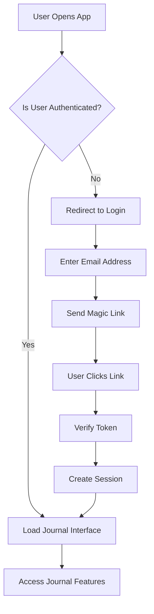

# Authentication & User Management

## Overview

Heijō Mini-Journal implements a **privacy-first authentication system** using Supabase Auth with **magic link authentication** and **local fallback** for offline functionality. The system ensures user data isolation while maintaining seamless user experience.

## Authentication Architecture

### Supabase Auth Integration

The app uses Supabase's built-in authentication system with the following features:

- **Magic Link Authentication**: Passwordless login via email
- **Session Management**: Automatic session handling and refresh
- **User Context**: React context for user state management
- **Offline Fallback**: Local authentication when Supabase unavailable

### Authentication Flow



## User Management System

### User Model

```typescript
interface User {
  id: string;
  email: string;
  created_at: string;
  last_sign_in_at: string;
  email_confirmed_at: string;
  app_metadata: {
    provider: string;
    providers: string[];
  };
  user_metadata: Record<string, any>;
  aud: string;
  role: string;
}
```

### Session Management

```typescript
interface Session {
  access_token: string;
  refresh_token: string;
  expires_in: number;
  expires_at: number;
  token_type: string;
  user: User;
}
```

## Authentication Components

### AuthProvider Context

The main authentication context provides user state and authentication methods:

```typescript
// lib/auth.tsx
interface AuthContextType {
  user: User | null;
  session: Session | null;
  loading: boolean;
  signIn: (email: string, password: string) => Promise<{ error: any }>;
  signUp: (email: string, password: string) => Promise<{ error: any }>;
  signOut: () => Promise<void>;
  signInWithMagicLink: (email: string) => Promise<{ error: any }>;
}

export function AuthProvider({ children }: { children: React.ReactNode }) {
  const [user, setUser] = useState<User | null>(null);
  const [session, setSession] = useState<Session | null>(null);
  const [loading, setLoading] = useState(true);

  // Initialize auth state
  useEffect(() => {
    if (!supabase) {
      setLoading(false);
      return;
    }

    // Get initial session
    supabase.auth.getSession().then(({ data: { session } }) => {
      setSession(session);
      setUser(session?.user ?? null);
      setLoading(false);
    });

    // Listen for auth changes
    const { data: { subscription } } = supabase.auth.onAuthStateChange(
      (_event, session) => {
        setSession(session);
        setUser(session?.user ?? null);
        setLoading(false);
      }
    );

    return () => subscription?.unsubscribe();
  }, []);
}
```

### Login Page Component

```typescript
// app/login/page.tsx
export default function LoginPage() {
  const [email, setEmail] = useState('');
  const [isLoading, setIsLoading] = useState(false);
  const [message, setMessage] = useState('');
  const { signInWithMagicLink } = useAuth();

  const handleMagicLink = async (e: FormEvent) => {
    e.preventDefault();
    setIsLoading(true);
    setMessage('');

    const { error } = await signInWithMagicLink(email);
    
    if (error) {
      setMessage('Error: ' + error.message);
    } else {
      setMessage('Check your email for the magic link!');
    }
    
    setIsLoading(false);
  };
}
```

## Authentication Methods

### 1. Magic Link Authentication (Primary)

**Preferred method** for privacy and security:

```typescript
const signInWithMagicLink = async (email: string) => {
  if (!supabase) return { error: new Error('Supabase not configured') };
  
  const { error } = await supabase.auth.signInWithOtp({
    email,
    options: {
      emailRedirectTo: `${window.location.origin}/journal`,
    },
  });
  return { error };
};
```

**Benefits:**
- No password required
- Enhanced security
- Better user experience
- Reduced attack surface

### 2. Traditional Email/Password (Fallback)

```typescript
const signIn = async (email: string, password: string) => {
  if (!supabase) return { error: new Error('Supabase not configured') };
  
  const { error } = await supabase.auth.signInWithPassword({
    email,
    password,
  });
  return { error };
};

const signUp = async (email: string, password: string) => {
  if (!supabase) return { error: new Error('Supabase not configured') };
  
  const { error } = await supabase.auth.signUp({
    email,
    password,
  });
  return { error };
};
```

## User Data Isolation

### Row Level Security (RLS)

Supabase tables implement RLS to ensure user data isolation:

```sql
-- Enable RLS on journal_entries table
ALTER TABLE journal_entries ENABLE ROW LEVEL SECURITY;

-- Policy: Users can only access their own entries
CREATE POLICY "Users can access own entries" ON journal_entries
  FOR ALL USING (auth.uid() = user_id);

-- Policy: Users can insert their own entries
CREATE POLICY "Users can insert own entries" ON journal_entries
  FOR INSERT WITH CHECK (auth.uid() = user_id);

-- Policy: Users can update their own entries
CREATE POLICY "Users can update own entries" ON journal_entries
  FOR UPDATE USING (auth.uid() = user_id);

-- Policy: Users can delete their own entries
CREATE POLICY "Users can delete own entries" ON journal_entries
  FOR DELETE USING (auth.uid() = user_id);
```

### Data Access Patterns

All database operations include user authentication:

```typescript
// lib/store.ts - SupabaseStorage class
async saveEntry(entry: JournalEntry): Promise<JournalEntry> {
  if (!supabase) throw new Error('Supabase not configured');
  
  // Get current user
  const { data: { user } } = await supabase.auth.getUser();
  if (!user) throw new Error('User not authenticated');
  
  const { data, error } = await supabase
    .from('journal_entries')
    .insert([{ 
      ...entry, 
      user_id: user.id,  // Ensure user isolation
      sync_status: 'synced',
      last_synced: new Date().toISOString()
    }])
    .select()
    .single();
  
  if (error) throw error;
  return data;
}
```

## Offline Authentication

### Local Authentication Fallback

When Supabase is unavailable, the app falls back to local authentication:

```typescript
// lib/auth.tsx
useEffect(() => {
  if (!supabase) {
    // Fallback to local authentication
    const localUser = localStorage.getItem('heijo-local-user');
    if (localUser) {
      setUser(JSON.parse(localUser));
    }
    setLoading(false);
    return;
  }
  // ... Supabase auth logic
}, []);
```

### Local User Management

```typescript
// Local user creation and management
const createLocalUser = (email: string) => {
  const localUser = {
    id: crypto.randomUUID(),
    email,
    created_at: new Date().toISOString(),
    is_local: true
  };
  
  localStorage.setItem('heijo-local-user', JSON.stringify(localUser));
  return localUser;
};
```

## Security Features

### Session Security

- **Automatic Token Refresh**: Sessions automatically refresh before expiration
- **Secure Storage**: Tokens stored securely in memory, not localStorage
- **CSRF Protection**: Built-in CSRF protection via Supabase
- **HTTPS Only**: All authentication requires HTTPS in production

### Privacy Protection

- **No Password Storage**: Magic link eliminates password storage
- **Minimal Data Collection**: Only email address required
- **Data Encryption**: All user data encrypted at rest
- **GDPR Compliance**: Full data export and deletion capabilities

### Rate Limiting

```typescript
// lib/rateLimiter.ts
export class RateLimiter {
  private requests: Map<string, number[]> = new Map();
  
  async isAllowed(identifier: string = 'default'): Promise<{
    allowed: boolean;
    reason?: string;
  }> {
    const now = Date.now();
    const windowMs = 60 * 60 * 1000; // 1 hour
    const maxRequests = 100;
    
    const userRequests = this.requests.get(identifier) || [];
    const recentRequests = userRequests.filter(time => now - time < windowMs);
    
    if (recentRequests.length >= maxRequests) {
      return {
        allowed: false,
        reason: 'Rate limit exceeded. Please try again later.'
      };
    }
    
    recentRequests.push(now);
    this.requests.set(identifier, recentRequests);
    
    return { allowed: true };
  }
}
```

## User Experience Features

### Seamless Authentication

- **Auto-redirect**: Users redirected to journal after successful login
- **Session Persistence**: Users stay logged in across browser sessions
- **Loading States**: Clear loading indicators during authentication
- **Error Handling**: User-friendly error messages

### Onboarding Flow

```typescript
// components/OnboardingModal.tsx
export default function OnboardingModal() {
  const [step, setStep] = useState(0);
  
  const steps = [
    { title: 'Welcome to Heijō', content: 'Your private journal...' },
    { title: 'Voice Recording', content: 'Tap and hold to record...' },
    { title: 'Privacy First', content: 'Your data stays private...' },
    { title: 'Ready to Start', content: 'Begin your journaling journey...' }
  ];
}
```

## Administrative Features

### User Management

- **User Analytics**: Track user engagement and usage patterns
- **Data Export**: Users can export all their data
- **Account Deletion**: Complete account and data removal
- **Session Management**: View and manage active sessions

### Monitoring and Logging

- **Authentication Events**: Log all login/logout events
- **Security Alerts**: Monitor for suspicious activity
- **Performance Metrics**: Track authentication performance
- **Error Tracking**: Monitor authentication failures

## Configuration

### Environment Variables

```env
# Supabase Configuration
NEXT_PUBLIC_SUPABASE_URL=your_supabase_url
NEXT_PUBLIC_SUPABASE_ANON_KEY=your_supabase_anon_key

# Authentication Settings
NEXT_PUBLIC_AUTH_REDIRECT_URL=http://localhost:3000/journal
NEXT_PUBLIC_AUTH_MAGIC_LINK_ENABLED=true
```

### Supabase Configuration

```typescript
// lib/supabaseClient.ts
const supabaseUrl = process.env.NEXT_PUBLIC_SUPABASE_URL;
const supabaseAnonKey = process.env.NEXT_PUBLIC_SUPABASE_ANON_KEY;

export const supabase = supabaseUrl && supabaseAnonKey 
  ? createClient(supabaseUrl, supabaseAnonKey)
  : null;
```

## Best Practices

### Security Best Practices

1. **Always validate user input** before authentication
2. **Use HTTPS in production** for all authentication
3. **Implement proper error handling** without exposing sensitive information
4. **Regular security audits** of authentication flows
5. **Monitor for suspicious activity** and implement alerts

### User Experience Best Practices

1. **Clear error messages** that help users understand issues
2. **Loading states** for all async operations
3. **Graceful degradation** when services are unavailable
4. **Consistent UI patterns** across authentication flows
5. **Accessibility compliance** for all authentication components

This authentication system ensures **secure**, **privacy-first**, and **user-friendly** access to the Heijō Mini-Journal application while maintaining offline functionality and data isolation.
